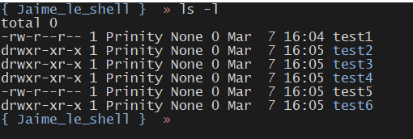

# J'aime le shell 🦀

Projet et exercices d'introduction au Shell.

Solution reproductibles en executant sur votre machine ce [script bash](./solveur.sh)

## Exercice 1

Dans un dossier `jaime-le-shell`, créer la suite de dossier et de fichier de sorte à ce que cela s’affiche :



Implémentation :

```bash
# Créer les fichiers test1 et test5
$ touch test{1,5}

# Créer les répertoires test2 à test4 et test6
$ mkdir test{{2..4},6}
```

Cette implémentation utilise le processus Bash appelé [Brace Extension](https://www.linuxjournal.com/content/bash-brace-expansion). Il permet de conserver un code [DRY](https://en.wikipedia.org/wiki/Don%27t_repeat_yourself) et plus facile à maintenir.

## Exercice 2

Créer un dossier dans la racine qui porte de nom de `le_shell_cest_trop_cool!`


Implémentation :

```bash
# Créer le dossier le_shell_cest_trop_cool! à la racine du projet
$ mkdir le_shell_cest_trop_cool!
```

## Exercice 3

Déplacer les les fichiers `test1` et `test5` dans le dossier que vous venez de créer, et copier les dossiers `test2` et `test6` dans le dossier que vous venez de créer.

Implémentation :

```bash
# Déplacer test1 et test5
$ mv test{1,5} le_shell_cest_trop_cool!

# Copier test2 et test6
cp -r test{2,6} le_shell_cest_trop_cool!
```

## Ressources

- [devhints.io](https://devhints.io/bash)
- [cmdchallenge](https://cmdchallenge.com/)
- [BashAcademy](https://guide.bash.academy/)

